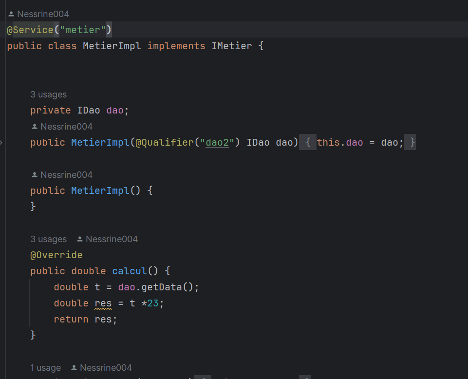

<h2>Injection des dépendances et Inversion de controle</h2>
<h4>Diagramme</h4>

<h4>Le fichier config.xml</h4>

<h4> l'interface IDao avec une méthode getData</h4>

<h4>l'implémentation de l'interface IDao</h4>

<h4>l'interface IMetier avec une méthode calcul</h4>

<h4>implémentation de cette interface en utilisant le couplage faible</h4>

<h4> Faire l'injection des dépendances : Par instanciation statique</h4>

<h4> Faire l'injection des dépendances : Par instanciation dynamique</h4>

<h4> Faire l'injection des dépendances : Par instanciation dynamique</h4>

<h4> En utilisant le Framework Spring: Version XML</h4>

<h4> En utilisant le Framework Spring:Version annotations</h4>

